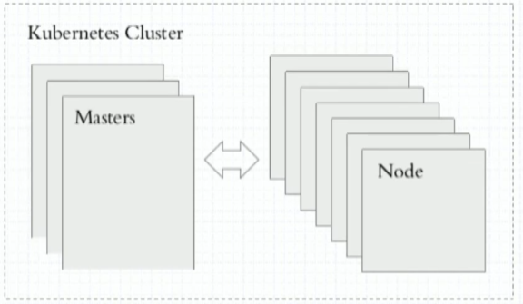

# :whale: Kubernetes

[](https://kubernetes.io/zh/docs/home/)

[](https://kubernetes.io/)

`container evolution`


## 容器编排

- Ansible/Saltstack **传统应用**编排工具
- Docker
  - docker compose(docker单机编排)
  - docker swarm(docker主机加入docker swarm资源池)
  - docker machine(完成docker主机加入docker swarm资源池的先决条件/预处理工具)
- Mesos(IDC OS) + marathon(面向容器编排的框架)
- kubernetes(Borg)
  - 自动装箱(基于依赖 自动完成容器部署 不影响其可用性)
  - 自我修复
  - 水平扩展
  - 服务发现和负载均衡
  - 自动发布和回滚
  - 密钥和配置管理
  - 存储编排
  - 任务批量处理运行

概念: `DevOps` `MicroServices` `Blockchain`

- CI: 持续集成
- CD: 持续交互 Delivery
- CD: 持续部署 Deployment

## Kubernetes架构概述



- 有中心节点的集群架构系统(抽象各主机资源 统一对外提供计算)
- Master/Node(Worker)
  - Master
    - etcd: 兼具一致性和高可用性的键值数据库 可以作为保存Kubernetes所有集群数据的后台数据库
    - API Server(公开kubernetes API)
    - Scheduler(调度器)
    - Controller-Manager(控制器)
      - 节点控制器(Node Controller): 负责在节点出现故障时进行通知和响应
      - 任务控制器(Job controller): 监测代表一次性任务的Job对象 然后创建Pods来运行这些任务直至完成
      - 端点控制器(Endpoints Controller): 填充端点(Endpoints)对象(即加入Service与Pod)
      - 服务帐户和令牌控制器(Service Account & Token Controllers): 为新的命名空间创建默认帐户和API访问令牌
  - Node
    - kubelet: 集群代理 并不运行容器
    - kube-proxy: 网络代理 管理Service的创建 更新(iptables/ipvs)
    - 容器运行时(容器引擎): 运行容器 支持[Docker](https://kubernetes.io/zh/docs/reference/kubectl/docker-cli-to-kubectl/)/[containerd](https://containerd.io/docs/)/[CRI-O](https://cri-o.io/#what-is-cri-o)以及任何实现 [Kubernetes CRI (容器运行环境接口)](https://github.com/kubernetes/community/blob/master/contributors/devel/sig-node/container-runtime-interface.md)

[kubernetes组件](https://kubernetes.io/zh/docs/concepts/overview/components/)


## Pod

- Pod
  - 自主式Pod
  - 控制器管理的Pod(建议使用)
    - ReplicationController(副本控制器)
    - ReplicaSet(副本集控制器 不直接使用 有一个声明式更新的控制器Deployment)
    - Deployment(管理无状态应用)
      - HPA(HorizontalPodAutoscaler) 水平Pod自动伸缩控制器
    - StatefulSet(有状态副本集)
    - DaemonSet
    - Job/CronJob
  - Label
    - Label Selector
    - Label: key=value

## Service

- iptables的DNAT规则(调度多个service后端 ipvs规则)
- 靠标签选择器 关联Pod对象
- service 名称 可以被解析(DNS Pod实现解析 - 基础架构级的Pod)
  - 基础架构级Pod `AddOns`集群附加组件 支撑其他服务需要使用到的服务
  - 动态更新DNS解析

## 网络通信

- 同一个Pod内的多个容器间: lo
- 各Pod之间的通信(不直接通信 通过Service通信)
  - 二层广播 -> 广播风暴
  - Overlay Network 叠加网络
    - 需要确保每一个Pod网络地址不会冲突
- Pod和Service之间的通信

依赖第三方插件(附件) 通过CNI(容器网络接口)接入

- flannel: 网络配置 Pod网络-10.244.0.0/16
- calico: 网络配置 网络策略(Pod之间、Namespace...之间的访问或隔离)
- canel: 上面两种搭配使用
- ...


## Namespace

- 管理的边界
- 隔离不同名称空间的网络

## 初始化Kubernetes集群


- [kubeadm](https://github.com/kubernetes/kubeadm)
  
  - master/nodes: 安装`kubetlet` `kubeadm` `docker`
  
  - master: `kubeadm init`
  
    ```bash
    # master init
    sudo kubeadm init \ 
      --kubernetes-version=v1.20.15 \     # k8s版本
      --pod-network-cidr=10.244.0.0/16 \  # pod网段
      --service-cidr=10.96.0.0/12 \       # service网段
      --ignore-preflight-errors=Swap      # 忽略预检错误
    ```
  
  - nodes: `kubeadm join`
  
    ```bash
    # nodes join
    sudo kubeadm join \
      10.211.55.57:6443 \
      --token hewmhd.fro3dttm001dohys \
      --discovery-token-ca-cert-hash sha256:826faddde57dc07d0fbf31e7aa809eb5fc22613787a2fc8ab50f55c4e706cd45
    ```
  
  - Images
  
    ```bash
    ilolicon@master:~$ sudo docker image ls
    REPOSITORY                           TAG        IMAGE ID       CREATED         SIZE
    k8s.gcr.io/kube-apiserver            v1.20.15   3ecdeee1255c   7 months ago    113MB
    k8s.gcr.io/kube-controller-manager   v1.20.15   403106abce42   7 months ago    108MB
    k8s.gcr.io/kube-scheduler            v1.20.15   bfc1b1725466   7 months ago    44.1MB
    k8s.gcr.io/kube-proxy                v1.20.15   3c1b1abd329d   7 months ago    93.6MB
    k8s.gcr.io/etcd                      3.4.13-0   05b738aa1bc6   24 months ago   312MB
    k8s.gcr.io/coredns                   1.7.0      db91994f4ee8   2 years ago     42.8MB
    k8s.gcr.io/pause                     3.2        2a060e2e7101   2 years ago     484kB  # 创建基础架构容器使用 为Pod提供底层基础结构 无需启动和运行
    ```

## k8s资源概述

- RESTful风格API
  - GET、POST、DELETE、PUT...
  - kubectl run、get、expose、edit...
- 资源(对象)
  - workload: Pod、ReplicaSet、Deployment、StatefulSet、DaemonSet、Job、Cronjob...
  - 服务发现与均衡: Service、Ingress...
  - 配置与存储: Volume、CSI...
    - ConfigMap、Secret
    - DownwardAPI
  - 集群级资源
    - Namespace、Node、Role、ClusterRole、RoleBinding、ClusterRoleBinding
  - 元数据型资源
    - HPA、PodTemplate、LimitRange

### 资源清单定义

- 创建资源的方法

  - apiserver仅接收json格式的资源定义

  - yaml格式提供配置清单 apiserver可自动将其转换为json格式 而后再提交

- 大部分资源的配置清单 主要都有五个主要的部分组成

  - apiversion
    - `kubectl api-versions` # 所属API群组
    - 标识方式: `group/version` 省略组名则为core group

  - kind: 资源类别
  - metadata: 元数据
    - name: 同一类别中 name需要唯一
    - namespace: 所属k8s的哪个名称空间
    - labels
    - annotations
    - 每个资源的引用PATH
      - `/api/${GROUP/VERSION}/namespace/${NAMESPACE}/${TYPE}/${NAME}`
  - spec(重要): 定义用户期望的状态 disired state
  - status: 当前状态 current state 本字段由Kubernetes集群维护

- 字段太多 可以借助`kubectl explain --help`命令查看详细信息

  - kubectl explain pod
  - kubectl explain pod.metadata

### Pod概述

#### 自主式Pod

```yaml
apiVersion: v1
kind: Pod
metadata:
  name: pod-demo
  namespace: default
  labels:
    app: myapp
    tier: frontend
spec:
  containers:
    - name: myapp
      image: nginx:alpine
    - name: busybox
      image: busybox:latest
      command:
        - "/bin/sh"
        - "-c"
        - "sleep 3600"
```

#### Pod资源

- spec.containers <[]object>

  ```yaml
  # kubectl explain pod.spec.containers
  - name: <string>
    image: <string>
    imagePullPolicy: <string>  # Always Never IfNotPresent
    ...

  # 修改镜像中的默认应用
  - command/args
  https://kubernetes.io/docs/tasks/inject-data-application/define-command-argument-container/
  ```

- 标签
  - key = value
    - key: 字母 数字 _ - .
    - value: 可以为空 只能字母或数字开头及结尾

- 标签选择器
  - 等值关系: =、==、!=(不等于会筛选出不具有该标签的资源)
  - 集合关系
    - KEY in (VALUE1,VALUE2,...)
    - KEY notin (VALUE1,VALUE2,...)
    - KEY    # 存在这个KEY就行
    - !KEY   # 不存在此键的资源

- 许多资源支持内嵌字段来使用标签选择器
  - matchLabels: 直接给定键值
  - matchExpressions: 基于给定的表达式来定义使用标签选择器
    - {key: "KEY", operator: "OPERATOR",values:[VAL1,VAL2,VAL3,...]
    - 操作符
      - In、NotIn: values字段的值必须为非空列表
      - Exists、NotExists: values字段的值必须为空列表

- spec.nodeSelector <map[striong]string>
  - 节点标签选择器
- spec.nodeName `<string>`  # 直接指定运行node
- annotations
  - 与label不同的地方在于 它不能用于挑选资源对象 仅用于为对象提供**元数据**
  - 没有键长度/值长度限制
- spec.restartPolicy
  - 重启策略: One of Always, OnFailure, Never. Default to Always

#### Pod生命周期

- 状态

  - Pending  # 调度尚未完成
  - Running  # 运行状态
  - Failed
  - Succeeded
  - Unknown
  - ...

- Pod生命周期中的重要行为

  - 初始化容器
  - 容器探测(自定义命令/TCP套接字发请求/HTTP应用层请求)
    - liveness probe: 探测容器是否存活
    - readiness probe: 探测容器是否准备就绪 能对外提供服务
  - 钩子
    - post start
    - pre stop

  

#### Pod容器探针类型

`kubectl explain pod.spec.containers.livenessProbe`

`kubectl explain pod.spec.containers.readinessProbe`

- exec Action
- httpGet Action
- tcpSocket Action

#### Pod控制器

- ReplicaSet

  - Kubectl explain replicaset
  - 用户期望副本数 标签选择器 Pod资源模版
  - 不建议直接使用ReplicaSet

  ```yaml
  apiVersion: apps/v1
  kind: ReplicaSet
  metadata:
    name: myapp
    namespace: default
  spec:
    replicas: 2
    selector:
      matchLabels:
        app: myapp
        release: canary
    template:
      metadata:
        name: myapp-pod
        labels:
          app: myapp
          release: canary
          environment: qa
      spec:
        containers:
        - name: myapp-container
          image: nginx:alpine
          ports:
          - name: http
            containerPort: 80
  ```

- Deployment
  - 构建在ReplicaSet之上 而非Pod
    - 实现滚动更新(多出或少于N个副本 控制更新粒度)、回滚
    - 通常管理10个历史版本(ReplicaSet)
  - 管理无状态应用最好的控制器
  - 无状态(只关注群体、不关注个体)、持续运行应用
  - 声明式管理(即可以创建 也可以更新 `kubectl apply -f deployment.yaml`)
  - `kubectl rollout history` 查看滚动历史


- DaemonSet
  
  - `kubectl explain deployment.spec.strategy.rollingUpdate` # 滚动更新策略
  
  - 确保集群中的每一个节点(或部分满足条件的节点)精确运行一个Pod副本
  - 通常用于一些系统级的后台任务
  - 无状态、持续运行应用
  
- Job
  - 只做一次 只要完成就正常退出 没完成才进行重构
  - 执行一次性的作业
  - 不需要持续在后台运行 执行完成就退出
  
- Cronjob
  - 周期性Job
  
- StatefulSet
  - 管理有状态应用
  - 每一个pod副本单独管理 拥有自己独有的标识和独有的数据集
  
- TPR: Third Party Resources 1.2+ - 1.7

- CDE: Custom Defined Resources 1.8+

- Operator

## Helm

- 类似yum

## Some Links

- ubuntu

[apt install speciffic version](https://askubuntu.com/questions/428772/how-to-install-specific-version-of-some-package/428778#428778?newreg=d056242a7a0340598dd1d2d4fad63e81)

[set-proxy-on-ubuntu-docker](https://www.serverlab.ca/tutorials/containers/docker/how-to-set-the-proxy-for-docker-on-ubuntu/)

[apt-get-like-yum-whatprovides](https://askubuntu.com/questions/2493/apt-get-or-aptitude-equivalent-to-yum-whatprovides)

- kubetnetes

[kubectl-get-commponentstatus-shows-unhealthy](https://stackoverflow.com/questions/63136175/kubectl-get-componentstatus-shows-unhealthy)
