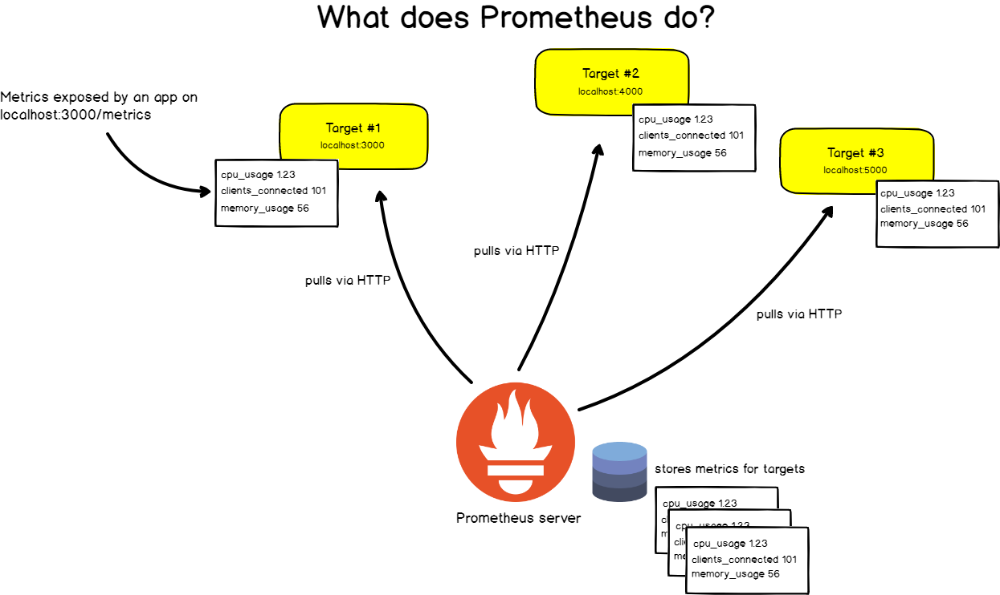
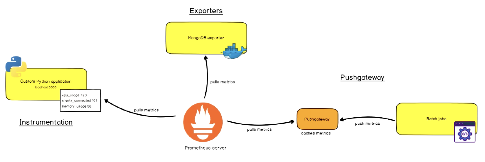
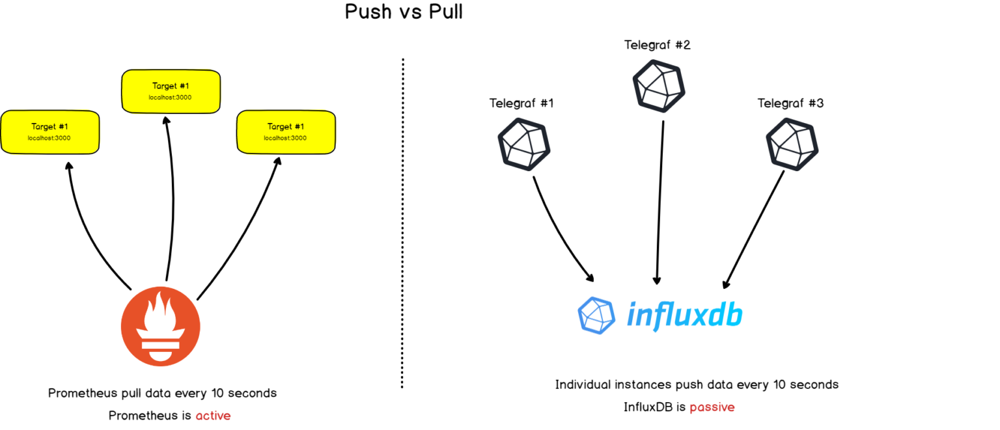
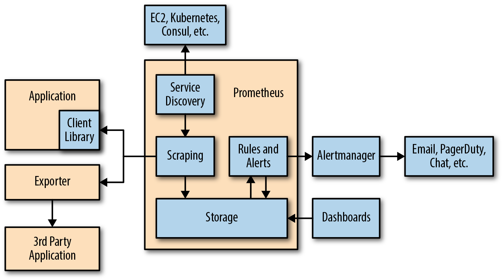
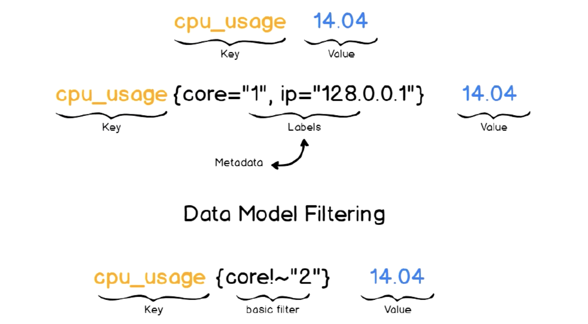
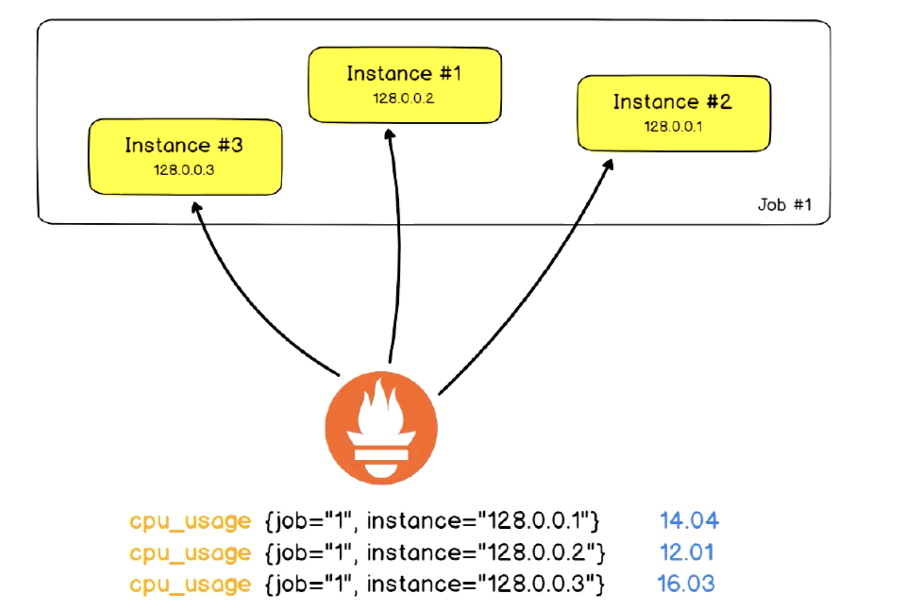
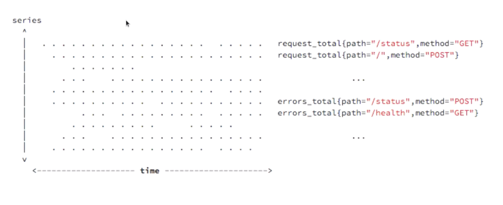
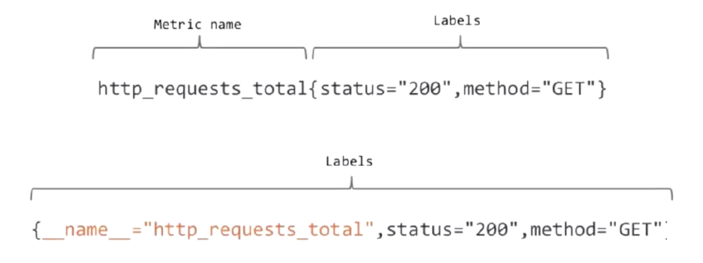
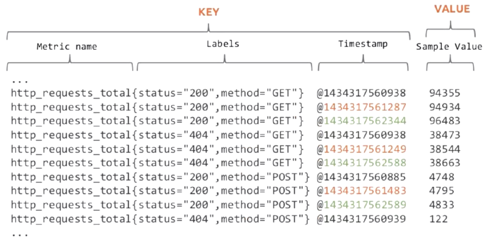
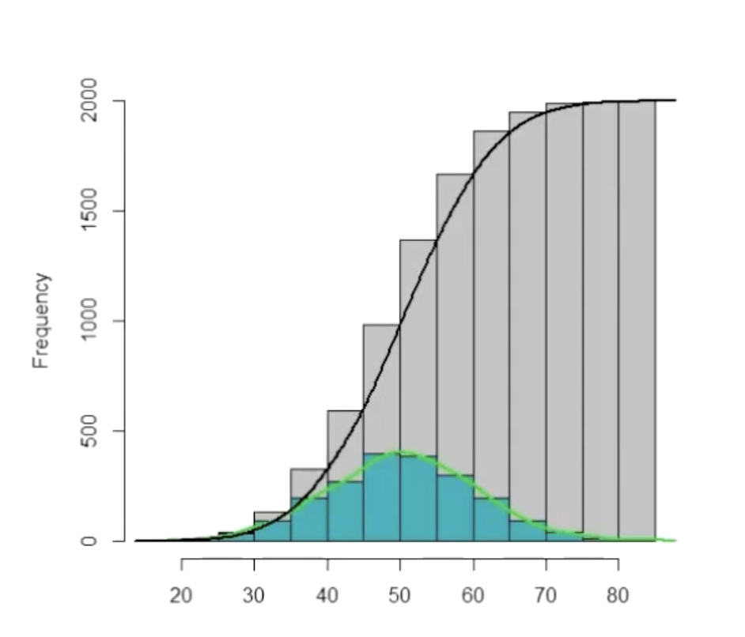

# :whale: Prometheus监控

[](https://prometheus.io/docs/introduction/overview/)

不稳定才是系统的恒态 稳定只是其中的一种特殊表现形式

## 监控系统的基础概念

### 监控系统组件

- 指标数据的采集(抓取)
- 指标数据存储
  - 存储持续写入性能
- 指标数据趋势分析及可视化
  - 分析、预测
  - 界面展示、直观查看
    - Zabbix自带
    - Open-Falcon/夜莺...
    - 通用的前台界面 如: Grafana
- 告警
  - 基础、核心功能之一
  - 表达式 -〉媒介(钉钉、微信、邮件...)

### 监控体系(自底向上)

- 系统层监控(关键指标)
  - 系统监控
    - CPU
    - Load
    - Memory
    - Swap
    - DiskIO
    - Processes
    - Kernel Parameters
    - ...
  - 网络监控
    - 网络设备
    - 工作负载
    - 网络延迟
    - 丢包率
    - ...
- 中间件及基础设施类系统监控
  - 消息中间件: Kafka、RocketMQ、RabbitMQ等
  - Web服务容器: Tomcat、Jetty等
  - 数据库及缓存系统: MySQL、PostgreSQL、MongoDB、ElasticSearch、Redis等
  - 存储系统: Ceph等
- 应用层监控
  - 用于衡量应用程序代码的状态和性能
- 业务层监控
  - 用于衡量应用程序的价值(销售指标等)
  - QPS、DAU日活、转化率
  - 业务接口: 登陆数、注册数、订单量、支付量、搜索量等

### 云原生时代的可观测性

[](https://landscape.cncf.io/)

- 可观测性系统
  - 指标监控(Metrics): 随时间推移产生的一些与监控相关的可聚合数据点
  - 日志监控(Logging): 离散式的日志或事件(`结构化`)
  - 链路跟踪(Tracing): 分布式应用调用链跟踪(调用时长/性能)

- CNCF将`可观测性`和`数据分析`归类为一个单独的类别 划分成了5个子类
  - 监控系统
  - 日志系统
  - 分布式调用链跟踪系统
  - 混沌工程系统: 结合监控系统提前发现问题
  - 持续优化

- Prometheus仅仅是可观测性中的一个纬度(指标监控)中的一个代表

### 著名的监控方法论

- Google的四个黄金指标
  - 常用于在服务级别帮助衡量终端用户体验、服务中断、业务影响等层面的问题
  - 适用于应用及服务监控
  - 四个黄金指标
    - 延迟(Latency)
      - 服务请求所需要的时长 如: HTTP请求平均延迟
      - 需要区分失败请求和成功请求
    - 流量(Traffic)
      - 衡量服务的容量需求 如: 每秒处理的HTTP1请求数 数据库系统的事务数量
    - 错误(Errors)
      - 请求失败的速率 用于衡量错误发生的情况
      - 显示失败(HTTP500) 隐式失败(返回错误内容/无效内容) 策略原因导致的失败(响应时间超过30ms请求视为失败)
    - 饱和度(Saturation): 服务受限资源
      - 衡量资源的使用情况 用于表达程序有多**满**
      - 如: CPU 内存 I/O 磁盘等资源的使用情况(NodeExporter)

- Netflix的USE方法
  - 主要用于分析系统性能问题 指导用户快速识别资源瓶颈以及错误的方法
  - 应用于主机指标监控
  - USE
    - 使用率(Utilization)
      - 关注资源的使用情况 主要包括但不限于CPU 内存 网络 磁盘等
      - 100%的使用率通常是系统性能瓶颈的标志
    - 饱和度(Saturation)
      - 如CPU的平均运行排队长度
      - 任何资源在某种程度上的饱和都可能导致系统性能的下降
    - 错误(Error)
      - 错误计数
      - 如: 网卡在数据包传输过程中检测到的以太网网络冲突了14次
  
- Weave Cloud的RED方法
  - Weave Cloud基于Google的四个黄金指标的原则下 结合Prometheus以及Kubernetes容器实践 细化和总结的方法论 特别适合云原生应用以及微服务架构应用的监控和度量
  - 在四大黄金指标的原则下 RED方法可以有效的帮助用户衡量云原生以及微服务应用下的用户体验问题
  - RED方法主要关注以下三种指标
    - (Request)Rate: 每秒钟接收的请求数
    - (Request)Errors: 每秒失败的请求数
    - (Request)Duration: 每个请求所花费的时长

## Prometheus入门

### What is Prometheus Monitoring

- Prometheus是一个**时序(Time Series)数据库** 但它的功能却并非止步于TSDB 而是一款设计用于进行目标(**Target**)监控的关键组件
- 结合其生态内的其他组件 如: Pushgateway Alertmanager Grafana等 可构成一个完整的IT监控系统

### 时序数据简介

- 时序数据是在一段时间内通过重复测量(measurement)而获得的观测值的集合
- 将这些观测值绘制于图形之上 它会有一个数据轴和一个**时间轴**
- 服务器指标数据、应用程序性能监控数据、网络数据等也都是时序数据


### What does Prometheus do

- 基于HTTP call 从配置文件中指定的网络端点(Endpoint)上周期性获取指标数据
- 最简单的逻辑如下图



### How does Prometheus work

- Prometheus支持通过三种类型的途径从目标上**抓取(Scrape)** 指标数据
  - Exporters
  - Instrumentation(测量系统 内建Prometheus兼容的指标暴露器)
  - Pushgateway(短生命周期任务 启动/结束时间不确定)



#### Instrumentation(程序仪表)

- 任何能够支持Scrape指标数据的应用程序都首先要具有一个测量系统
- 在Prometheus的语境中 Instrumentation是指附加到应用程序中的那些用于暴露程序指标数据的客户端库
  - 程序员借助于这些客户端库编写代码生成可暴露的指标数据

#### Exporters

- 对于那些未内建Instrumentation 且也不便于自行添加该类组件以暴露指标数据的应用程序来说 常用的办法是于待监控的目标应用程序外部运行u一个独立指标暴露程序 该类型的程序即统称为Exporter
- 换句话说 Exporter负责从目标应用程序上采集和聚合原始格式的数据 并转换或聚合为Prometheus格式的指标向外暴露
- Prometheus站点上提供了大量的Exporter

### Pull and Push

- Prometheus同其它TSDB相比有一个非常典型的特征: 它主动从各Targers上**拉取(pull)** 数据 而非等待被监控端的**推送(Push)**
- 两种方式各有优劣 其中 Pull模型的优势在于: 
  - 集中控制: 有利于将配置集中在Prometheus Server上完成 包括指标及采集速率等
  - Prometheus的根本目标在于收集在Target上预先完成聚合的聚合型数据 而非一款由事件驱动的存储系统



### Prometheus的生态组件

[promtheus-architecture](https://prometheus.io/docs/introduction/overview/#architecture)

- Prometheus负责时序型指标数据的采集及存储 但数据的分析/聚合及直观展示以及告警等功能并非由Prometheus Server负责




- Prometheus生态包含多个组件 其中部分组件可选
  - Prometheus Server: 收集和存储时间序列数据 Prometheus监控系统的核心组件
  - Client Library: 客户端库 目的在于为那些期望原生提供Instrumentation功能的应用程序提供便捷的开发途径
  - Push Gateway: 接收那些通常由短期作业生成的指标数据的网关 并支持由Prometheus Server进行指标拉取操作
  - Exporters: 用于暴露现有应用程序或服务(不支持Instrumentation)的指标给Prometheus Server
    - node_exporter
    - Blackbox_exporter
    - Mysql_exporter
    - ...
  - Alertmanager: 从Prometheus Server接收到**告警通知**后 通过去重 分组 路由等预处理功能后以高效向用户完成告警信息的发送
  - Data Visualization: Prometheus Web UI(内建 PromQL表达式浏览器) 及Grafana等
  - Service Discovery: 动态发现待监控的Target 从而完成监控配置的重要组件 在容器化环境尤为有用 该组件目前由Prometheus Server内建支持

### Prometheus数据模型(Data Model)

[prometheus-data-model](https://prometheus.io/docs/concepts/data_model/)

- Prometheus仅用于以**键值**形式存储时序式的聚合数据 它并不支持存储文本信息
  - 其中的**键**称为指标(Metric) 它通常意味着CPU速率 内存使用率或分区空闲比例等
  - 同一指标可能为适配到多个目标或设备 因而他使用**标签**作为元数据 从而为Metric添加更多的信息描述维度
  - 这些标签还可以作为过滤器进行指标过滤及聚合运算



### 指标类型(Metric Types)

[prometheus-metric-types](https://prometheus.io/docs/concepts/metric_types/)

- Prometheus使用4种方法来描述监控的指标
  - Counter: **计数器** 用于保存单调递增型的数据 例如: 站点访问次数等 不能为负值 也不支持减少 但可以重置回0
  - Gauge: **仪表盘** 用于存储有着起伏特征的指标数据 例如: 内存使用情况等
    - Gauge是Counter的超集 但存在指标数据丢失的可能性
    - Counter能让用户确切了解指标随的变化状态 而Gauge则可能随时间流逝而精准度越来越低
  - Histogram: **直方图** 它会在一段时间范围内对数据进行采样 并将其计入可配置的bucket中 Histigram能够存储更多的信息 包括样本值分布在每个bucket中的数量、所有样本值之和以及总的样本数量 从而Prometheus能够使用内置的函数进行如下操作: 
    - 计算样本平均值: 以值的总和除以值的数量
    - 计算样本分为值: 分为数有助于了解符合特定标准的数据个数 如: 评估响应时长超过1s的请求比例 若超过20%即发送告警等
  - Summary: **摘要** Histogram的扩展类型 但它是直接由被检测端自行聚合计算出分位数 并将计算结果响应给Prometheus Server的样本采集请求

### 作业(Job)和实例(Instance)

- Instance: 能够接收Prometheus Server数据Scrape操作的每个网络网络端点(endpoint) 即为一个Instance(实例)
- 通常 具有类似功能的Instance的集合称为一个Job 如: 一个MySQL主从复制集群中的所有MySQL1进程



### Promtheus Query Language

- Prometheus提供了内置的数据查询语言PromQL(Prometheus Query Language) 支持用户进行实时的数据查询及聚合操作
- PromQL支持处理两种**向量** 并内置提供了一组用于数据处理的**函数**
  - 即时向量: 最近一次的时间戳上跟踪的数据指标
  - 时间范围向量: 指定时间范围内的所有时间戳上的数据指标


### Alerts

- 抓取到异常值后 Prometheus支持通过**告警(Alert)** 机制向用户发送反馈或警示 会触发用户能够及时采取应对措施
- Prometheus Server仅负责生成告警指示 具体的告警行为由另一个独立的应用程序**Alertmanager**负责
  - 告警指示由Prometheus Server基于用户提供的**告警规则** 周期性计算生成
  - Alertmanager接收到Prometheus Server发来的告警指示后 基于用户定义的**告警路由(route)**向告警**接收人(reveivers)**发送告警信息

### Prometheus局限性

- Prometheus是一款指标监控系统 不适合存储事件及日志等 它更多展示的是趋势性的监控 而非精准数据
- Prometheus认为只有最近的监控数据才有查询的需要 其本地存储的设计初衷只是保存短期(如一个月)数据 因而不支持针对大量的历史数据进行存储
  - 若需要存储长期的历史数据 建议基于远程存储机制将数据保存于InfluxDB或OpenTSDB
- Prometheus的集群机制成熟度不高

## 运行Prometheus

[rpm-repo](https://packagecloud.io/prometheus-rpm/release/install#bash-rpm)

- CPU使用率
  - 每台主机CPU在5分钟内的平均使用率
  - `(1 - avg(irate(node_cpu_second_total{mode="idle"}[5m])) by (instance)) * 100`

- CPU饱和度
  - 跟踪CPU的平均负载就能获取到相关主机的CPU1饱和度 实际上 它是将主机上的CPU数量考虑在内的一段时间内的平均运行队列长度
  - 平均负载少于CPU的数量是正常情况 而长时间内超过CPU数量则表示CPU毅然饱和
  - `node_load1 > on(instance) 2 * count(node_cpu_seconds_total{mode="idle"}) by (instance)`
    - 查询1分钟平均负载超过主机CPU数量两倍的时间序列
    - CPU瓶颈、程序BUG
    - 控制平面
- 内存使用率
  - node_exporter暴露了多个以node_memory为前缀的指标 我们重点关注下面几个
    - `node_memory_MemTotal_bytes`
    - `node_memory_MemFree_bytes`
    - `node_memory_Buffers_bytes`
    - `node_memory_Cached_bytes`
  - 计算使用率
    - 可用空间: 上面后三个指标之和
    - 已用空间: 总空间减去可用空间
    - 实用率: 已用空间除以总空间

## Exporters

[exporters-and-integrans](https://prometheus.io/docs/instrumenting/exporters/#exporters-and-integrations)

- node_exporter
- blackbox_exporter
- mysql_exporter
- ...

### 客户端库

- 应用程序自己并不会直接生成指标数据 这依赖于开发人员将相关的客户端库添加至应用程序中构建出的测量系统(instrumentation system)来完成
  - 官方库语言支持: Go、Python、Java(或Scala)和Ruby
  - 第三方库语言支持: Bash(pushgateway)、C、C++、C#、Node.js、Haskell、Erlang、Perl、PHP、Rust

### Exporter基础

- 对于那些非用户可直接控制的应用代码来说 为其添加客户端库以进行直接测量很难实现
  - 操作系统内核就是一个典型的示例 它显然不太可能易于实现添加自定义代码并通过HTTP协议输出Prometheus格式的指标
  - 但这一类程序一般都会通过某种接口输出其内在的指标 只不过这些指标可能有着特殊的格式 如: Linux内核的特有指标格式 或者SNMP指标格式等
  - 这些指标需要对它进行适当的解析和处理以转换为可用的目标格式 Exporter就是完成此类转换功能的应用程序
- Exporter独立运行于要获取其测量指标的应用程序之外 负责接收来自于Prometheus Server的指标获取请求 它通过目标应用程序(真正的目标)内置的指标接口获取指标数据 并将这些指标数据转换为可用的目标格式后响应给Prometheus
  - Exporter更像是**一对一**的代理 它作为Prometheus Server的target存在 工作于应用程序的指标接口和Prometheus的文本指标格式之间转换数据格式
  - Exporter不存储也不缓存任何数据

## PromQL

### PromQL简介

- Prometheus基于指标名称(metrics name)以及附属的标签集(labelset)唯一定义一条时间序列
  - 指标名称代表着监控目标上某类可测量属性的基本特征标识
  - 标签则是这个基本特征上再次细分的多个可测量维度
- 基于PromQL表达式 用户可以针对指定的特征及其细分维度进行过滤、聚合、统计等运算 从而产生期望的计算结果
- PromQL是Prometheus Server内置的数据查询语言
  - PromQL使用表达式(expression)来表达查询需求
  - 根据其使用的指标和标签 以及时间范围 表达式的查询请求可灵活覆盖在一个或多个时间序列的一定范围内的样本之上 甚至是只包含单个时间序列的单个样本

#### Prometheus时间序列

- 时间序列数据: 按照时间顺序 记录系统、设备状态变化的数据 每个数据称为一个**样本**
  - 数据采集以特定的时间周期进行 因而 随着时间流逝 将这些样本数据记录下来 将生成一个离散的样本数据序列
  - 该序列也称为向量(Vector) 而将多个序列放在同一个坐标系内(以时间为横轴 以序列为纵轴) 将形成一个由数据点组成的矩阵



#### Prometheus数据模型

- Prometheus中 每个时间序列都由指标名称(Metric Name)和标签(Label)来唯一标识 格式为`<metric name>{<label name>=<label value>, ...}`
  - 指标名称: 通常用于描述系统上要测量的某个特征
    - 如: `http_requests_total`表示接收到的HTTP请求总数
    - 支持使用字母、数字、下划线和冒号 且必须能匹配RE2规范的正则表达式
  - 标签: 键值型数据 附加在指标名称之上 从而让指标能够支持多维度特征 可选
    - 如: `http_requests_total{method="GET"}` 和 `http_request_total{method="POST"}`代表两个不同的时间序列
    - 标签名称可使用字母、数字和下划线 切必须能匹配RE2规范的正则表达式
    - 以 **_ _** 为前缀的名称为Prometheus系统预留使用
  - Metric Name的表示方式有两种
    - 后一种通常用于Prometheus内部



#### 样本数据格式

- Prometheus的每个数据样本由两部分组成
  - float64格式的数据
  - 毫秒精度的时间戳



#### 指标名称及标签使用注意事项

- 指标名称和标签的特定组合代表着一个时间序列
  - 指标名称相同 但标签不同的组合分别代表着不同的时间序列
  - 不同的指标名称自然更是标识不同的时间序列
- PromQL支持**基于定义的指标维度进行过滤和聚合**
  - 更改任何标签值 包括添加标签或删除标签 都会创建一个新的时间序列
  - 应该尽可能保持标签的稳定性 否则很可能创建新的时间序列 更甚者会生成一个动态的数据环境 并使得监控的数据源难以跟踪 从而导致建立在该指标之上的图形、告警记录规则变得无效


#### PromQL的数据类型

- PromQL的表达式中支持4种数据类型
  - 即时向量(Instant Vector): 特定或全部的时间序列集合上 具有相同时间戳的一组样本值 称为即时向量
  - 范围向量(Range Vector): 特定或全部的时间序列集合上 在指定的统一时间范围内的所有样本值
  - 标量(Scalar): 一个浮点型(float64)的数据值
  - 字符串(String): 支持使用单引号、双引号或反引号进行引用 但反引号中不会对转义字符串进行转义

### 时间序列选择器

#### 即时向量与范围向量

- PromQL的查询操作需要针对有限个时间序列上的样本数据进行 挑选出目标时间序列是构建表达式最为关键的一步
- 用户可以使用向量选择器表达式来挑选出给定指标名称下的所有时间序列或部分时间序列的即时(当前)样本值 或至过去某个时间范围内的样本值 前者称为即时向量选择器 后者称为范围向量选择器
  - 即时向量选择器(Instant Vector Selectors): 返回0个、1个或多个时间序列上在给定时间戳(instant)上的各自的一个样本 该样本也可称为即时样本
  - 范围向量选择器(Range Vector Selectors): 返回0个、1个或多个时间序列上在给定时间范围内的各自的一组样本


#### 向量表达式使用要点

- 表达式的返回值类型亦是即时向量、范围向量、标量或字符串4种数据类型其中之一 但是有些使用场景要求表达式返回值必须满足特定条件
  - 需要将返回值绘制成图形时 仅支持即时向量类型的数据
  - 对于诸如`rate`一类的速率函数来说 其要求使用的必须是范围向量型的数据
- 由于范围向量选择器返回的是范围向量型数据 它不能用于表达式浏览器中图形绘制功能 否则表达式浏览器会返回相应错误
  - 事实上 范围向量几乎总是结合速率类的函数`rate`一同使用

#### 即时向量选择器

- 即时向量选择器由两部分组成
  - 指标名称: 用于限定特定指标下的时间序列 即负责过滤指标 可选
  - 匹配器(Matcher): 或称为标签选择器 用于过滤时间序列上的标签 定义在{}中 可选
- 定义即时向量选择器时 以上两个部分应该至少给出一个 于是将存在下面三种组合
  - 仅给定指标名称 或者标签名称上使用空值匹配器: 返回给定指标下的所有时间序列各自的即时样本
    - 如: http_requests_total/http_requests_total{}
  - 仅给定匹配器: 返回所有符合给定匹配器的所有时间序列上的即时样本
    - 注意: 这些时间序列可能有着不同的指标名称
    - 如: {job=~".*", method="GET"}
  - 指标名称和匹配器的组合: 返回给定的指标下 且符合给定标签过滤器的所有时间序列上的即时样本
    - 如: http_requests_total{methdo="GET"}

#### 匹配器(Matcher)

[time-series-selectors](https://prometheus.io/docs/prometheus/latest/querying/basics/#time-series-selectors)

- 匹配器用于定义标签过滤条件 目前支持4种匹配操作符
  - **=**: Select labels that are exactly equal to the provided string.
  - **!=**: Select labels that are not equal to the provided string.
  - **=~**: Select labels that regex-match the provided string.
  - **!~**: Select labels that do not regex-match the provided string.
- 注意事项
  - 匹配到空标签值的匹配器时 所有未定义该标签的时间序列同样符合条件
    - 如: `http_requests_total{env=""}`会匹配到`http_requests_total{method="GET"}`
  - 正则表达式将执行完全锚定机制 它需要匹配指定的标签的整个值
  - 向量选择器至少要包含一个指标名称 或者至少有一个不会匹配到空字符串的匹配器
    - 如: `{job=""}` 为非法的选择器
  - 使用`__name__`做为标签名称 还能够对指标名称进行过滤(联邦集群时常用到)
    - 如: `{__name__=~"http_requests_.*"}`能够匹配所有以`http_requests_`为前缀的所有指标

#### 范围向量选择器

- 同即时向量选择器的唯一不同之处在于 范围向量选择器需要在表达式后紧跟一个方括号[]来表达需在时间序列上返回的样本所处的时间范围
  - 时间范围: 以当前的时间为基准的时间点 只想过去一个特定的时间长度
  - 如: [5m] 指过去5分钟之内
- 时间格式: 一个整数后紧跟一个时间单位(Time Durations)
  - 可用单位: ms(毫秒)/s(秒)/m(分钟)/h(小时)/d(天)/w(周)/y(年)
  - 必须使用整数时间 且能够将多个不同级别的单位进行组合 以时间单位由大到小排序
    - [x] 1h30m
    - [ ] ~~1.5h~~
    - [x] 5h
    - [x] 10s
    - [x] 2d
- 需要注意的是 范围向量选择器返回的是一定时间范围内的数据样本 虽然不同时间序列的数据抓取时间点相同 但它们的时间戳并不会严格对齐
  - 多个Target上的数据抓取需要分散在抓取时间点前后一定的时间范围内 以均衡Prometheus Server的负载
  - 因而 Prometheus在趋势上准确 但并非绝对精准

#### 偏移量修改器

- 默认情况下 即时向量选择器和范围向量选择器都以当前时间为基准时间点 而偏移量修改器能够修改该基准
- 偏移量修改器的使用方法是紧跟在选择器表达式之后使用**offset**关键字指定
  - `http_requests_total offset 5m` 表示获取以http_requests_total为指标名称的所有时间序列在过去5分钟时的**即时样本**
  - `http_requests_total[5m] offset 1d` 表示获取距此刻1天时间之前的5分钟之内的所有样本


### PromQL指标类型

- PromQL主要有四个指标类型 它们主要由Prometheus的客户端库使用
  - Counter: 计数器 单调递增 除非重置(如: 服务器或进程重启)
  - Gauge: 仪表盘 可增可减的数据
  - Histogram: 直方图 将时间单位内的数据划分成不同的时间段 并各自评估其样本个数及样本值之和 因而可计算出分位数
    - 可用于分析因异常值而引起的平均值过大的问题
    - 分位数计算要使用专用的histogram_quantile函数
  - Summary: 类似直方图 但客户端会直接计算并上报分位数
- Prometheus Server并不使用类型信息 而是将所有数据展平为时间序列


#### Counter和Gauge

- 通常 Counter的总数并没有直接作用 而使需要借助于rate、topk、increase和irate等函数来生成样本数据的变化状况(增长率)
  - `rate(hrrp_requests_total[2h])` 获取2小时内 该指标下各时间序列上的http总请求数的增长速率
  - `topk(3, http_requests_total)` 获取该指标下http请求总数排名前3的时间序列
  - `irate(http_request_total[2h])` 高灵敏度函数 用于计算指标的瞬时速率
    - 基于样本范围内的最后两个样本进行计算 相较于rate函数来说 irate更适合用于短期时间范围内的变化速率分析
- Gauge用于存储其值可增可减的指标样本数据 常用于进行求和、取平均值、最小值、最大值等聚合计算 也会经常结合PromQL的predict_linear和delta函数使用
  - `predict_linear(v range-vector, t, scaler)`函数可以预测时间序列v在t秒后的值 它通过线性回归的方式来预测样本数据的Gauge变化趋势
  - `delta(v range-vector)`函数计算范围向量中每个时间序列元素的第一个值与最后一个值之差 从而展示不同时间点上的样本值差值
  
#### Histogram

- Histogram是一种对数据分布情况的图形展示 由一系列高度不等的长条图(bar)或线段表示 用于**展示耽搁测度的值的分布**
  - 它一般用横轴表示某个指标维度的数据取值的分布状况 用纵轴表示样本统计的频率和频数 从而能够以二维图的形式展现数值的分布状况
  - 为了构建Histogram 首先需要将值的范围进行分段 即将所有值的整个可用范围分成一系列连续、相邻(相邻出可以是等同值)但不重叠的间隔 而后统计每个间隔中有多少值
  - 从统计学的角度看 分位数不能被聚合 也不能进行算数运算


- 对于Prometheus来说 Histogram会在一段时间范围内对数据进行采样(通常是请求持续时长或响应大小等) 并将其计入可配置的bucket(存储桶)中
  - Histogram事先将特定测度可能的取值范围分割为多个样本空间 并通过对落入bucket内的观测值进行计算以及求和操作
  - 与常规的方式略有不同的是 Prometheus取值间隔的划分采用的是累积(Cumulative)区间间隔机制 及每个bucket中的样本均包含了其前面所有bucket中的样本 因而也称为累积直方图
    - 可降低Histogram的维护成本
    - 支持粗略计算样本值的分位数
    - 单独提供了_sum和_count指标 从而支持计算平均值



- Histogram类型的每个指标有一个基础指标名称`<basename>` 它会提供多个时间序列
  - `<basename>_bucket{le="<upper inclusive bound>"}`: 观测桶的上边界 及样本统计区间；最大区间(包含所有样本)的名称为`<basename>_bucket{le="+Inf"}`
  - `<basename>_sum`: 所有样本观测值的总和
  - `<basename>_count`: 总的观测次数 它自身本质上是一个Counter类型的指标
- 累积间隔机制生成的样本数据需要额外使用内置的histogram_quantile()函数 即可根据Histogram指标来计算相应的分位数(quantile) 及某个bucket的样本数在所有样本数中所占的比例
  - `histogram_quantile()`函数在计算分位数时会假定每个区间内的样本满足线性分布状态 因为它的结果是一个预估值 并不完全准确
  - 预估的准确度取决于bucket区间划分的粒度 粒度越大 准确度越低

#### Summary

- 指标类型是客户端库的特性 而Histogram在客户端仅是简单的桶划分和分桶计数 分位数的计算由Prometheus Server基于样本数据进行估算 因而其结果未必准确 甚至不合理的bucket划分会导致较大的误差
- Summary是一种类似于Histogram的指标类型 但它在客户端于一段时间内默认10分钟)的每个采样点进行统计 计算并存储了分位数数值 Server端直接抓取相应值即可
- 但是 Summary不支持sum和avg一类的集合运算 而且其分位数由客户端计算并生成 Server端无法获取客户端未定义的分位数 而Histogram可通过PromQL任意定义 有着较好的灵活性
- 对于每个指标 Summary以指标名称`<basename>`为前缀 生成如下几个时间序列
  - `<basename>{quantile="<φ>"}` 其中φ是分位点 其取值范围是(0<=φ<=1) 计数器类型指标 如下是几种典型的分位点
    - 0、0.25、0.5、0.75和1几个分位点
    - 0.5、0.9和0.99几个分位点
    - 0.01、0.05、0.5、0.9和0.99几个分位点
  - `<basename>_sum` 抓取到的所有样本值之和
  - `<basename>_count` 抓取到的所有样本总数

### PromQL运算

#### Prometheus的聚合函数

- 一般来说 单个指标的价值不大 监控场景中往往需要联合并可视化一组指标 这种联合机制即时指**聚合**操作 如: 将计数、求和、平均值、分位数、标准差及方差等统计函数应用于时间序列的样本之上生成具有统计学意义的结果等
- 对查询结果事先按照某种分类机制进行分组(groupby) 并将查询结果按组进行聚合计算也是较为常见的需求 如: 分组统计、分组求平均值、分组求和等
- 聚合操作由**聚合函数**针对一组值进行计算并返回单个值或少量几个值作为记过
  - Prometheus内置提供的11个聚合函数也称为聚合运算符
  - 这些运算符**仅支持**应用于**单个即时向量**的元素 器返回值也是具有少量元素的新向量或标量
  - 这些聚合运算符既可以基于向量表达式返回结果中的时间序列的所有标签维度进行分组聚合 也可以仅基于指定的标签维度分组后再进行分组聚合

#### 聚合表达式

- PromQL中的聚合操作语法格式可采用如下两种格式之一
  - `<aggr-op>([parameter,]<vector expression>)[without|by(<label list>)]`
  - `<aggr-op>[without|by(label list)]([parameter,]<vector expression>)`
- 分组聚合: 先分组、在聚合
  - without: 从结果向量中删除由without指定的标签 未指定的那部分标签则用作分组标准
  - by: 功能和without相反 它仅使用by子句中指定的标签进行聚合 结果向量中出现但未被by子句执行的标签则会被忽略
    - 为了保留上下文信息 使用by子句时需要显式指定其结果中原本出现的job、instance等一类的标签
- 事实上 各函数工作机制的不同之处也仅在于计算操作本身 PromQL对它们的执行逻辑相似

#### 11个聚合函数

- sum(): 对样本值求和
- avg(): 对样本值求平均值 这是进行指标数据分析的标准方法
- count(): 对分组内的时间序列进行数量统计
- stddev(): 对样本值求标准差 以帮组用户了解数据的波动大小(或称之为波动程度)
- stdvar(): 对样本值求方差 它是求取标准差过程中的中间状态
- min(): 求取样本值中的最小者
- max(): 求取样本值中的最大者
- topk(): 逆序返回分组内的样本值最大的前k个时间序列及其值
- bottomk(): 顺序返回分组内样本值最小的前k个时间序列及其值
- quanlite(): 分位数用于评估数据的分布状态 该函数会返回分组内指定的分位数的值 即数值落在小于等于执行的分位区间的比例
- count_values(): 对分组内的时间序列的样本值进行数量统计
  
#### 二元运算符

- PromQL支持基本的算数运算和逻辑运算 这类运算支持使用操作符连接两个操作数 因而也称为二元运算符或二元操作符
  - 支持的运算
    - 两个标量间运算
    - 即时向量和标量间的运算: 将运算符应用于向量上的每个样本
    - 两个即时向量间的运算: 遵循向量匹配机制
  - 将运算符用于两个即时向量间的运算时 可基于**向量匹配**模式定义器运算机制
- 算数运算
  - 支持运算符: +、-、*、/、%(取模)、^(幂运算)
- 比较运算
  - 支持运算符: ==、!=、>、<、>=、<=
- 逻辑/集合运算
  - 支持的运算符: and、or、unless(除了)
  - 目前 该运算仅允许在两个即时向量间进行 尚不支持标量参与运算

#### 向量匹配

- 即时向量间的运算时PromQL的特色之一 运算时 PromQL会为左侧向量中的那个元素找到匹配的元素 其匹配行为有两种基本类型
  - 一对一(One-to-One)
  - 一对多或多对一(Many-to-One One-to-Many)

##### 向量一对一匹配

[one-to-one-vector-matches](https://prometheus.io/docs/prometheus/latest/querying/operators/#one-to-one-vector-matches)

- 即时向量的一对一匹配
  - 从运算符的两边表达式所获取的即时向量间一次比较 并找到唯一匹配(标签完全一致)的样本值
  - 找不到匹配项的值则不会出现在结果中
- 匹配表达式语法
  - `<vector expr> <bin-op> ignoring(<label list>) <vector expr>`
  - `<vector expr> <bin-op> on(<label list>) <vector expr>`
    - ignore: 定义匹配检测时要忽略的标签
    - on: 定义匹配检测时只使用的标签
  - 如: `rate(http_requests_total{status_code=~"5.*"}[5m]) > .1*rate(http_requests_total[5m])`
    - 左侧会生成一个即时向量 它计算出5xx响应码的各类请求的增长速率
      - 除了status_code标签外 该指标通常还有其他标签 于是 status_code的值为500的标签同其他标签的每个组合代表一个时间序列 其相应的即时样本即为结果向量的一个元素
    - 右侧会生成一个即时向量 它计算出所有标签组合所代表的各类请求的增长速率
    - 计算时 PromQL会在操作符左右两侧的结果元素中找到标签完全一致的元素进行比较
    - 其意义为: 计算出每类请求中的5xx响应码在该类请求中所占的比例

##### 一对多/多对一匹配

[many-to-one-and-one-to-many-vector-matches](https://prometheus.io/docs/prometheus/latest/querying/operators/#many-to-one-and-one-to-many-vector-matches)

- 一对多/多对一匹配
  - **一**侧的每个元素 可与**多**侧的多个元素进行匹配
  - 必须使用group_left或group_right明确指定哪侧为**多**侧
- 匹配表达式语法
  - `<vector expr> <bin-op> ignoring(<label list>) group_left(<label list>) <vector expr>`
  - `<vector expr> <bin-op> ignoring(<label list>) group_right(<label list>) <vector expr>`
  - `<vector expr> <bin-op> on(<label list>) group_left(<label list>) <vector expr>`
  - `<vector expr> <bin-op> on(<label list>) group_left(<label list>) <vector expr>`

## 服务发现

- Prometheus指标抓取的生命周期
  - 发现 -> 配置 -> relabel -> 指标数据抓取 -> metrics relabel
- Prometheus Server监控Target
  - 静态配置(static configs)
  - 动态发现/Prometheus的服务发现(监控环境变化频繁/动态环境)
    - 基于文件的服务发现
      - 略优于静态配置 不依赖于任何第三方服务或平台 因而也是最简单和通用的实现方式
    - 基于DNS的服务发现
    - 基于API的服务发现: Kubernetes、Consul、Azure、...
- 重新标记
  - target重新打标
  - mertric重新打标

### 为何要进行服务发现

- Prometheus Server的数据抓取工作于Pull模型 因而 它必须事先知道各Target的位置 然后才能从相应的Exporter或Instrumentation中抓取数据
  - 对于小型的系统环境来说 通过static_configs指定各Target便能解决问题 这也是最简单的配置方法
    - 每个Targets用一个网络端点(ip:port)标识
  - 对于中大型的系统环境或具有较强动态性的云计算环境来说 静态配置显然难以适用
  - Prometheus为此专门设计了一组服务发现机制 以便于能够基于服务注册中心(服务总线)自动发现、检测、分类可被监控的各Target 以及更新发生了变动的Target

### 指标抓取的生命周期

- 下图展示了Prometheus上进行指标抓取的简单生命周期
  - 在每个scrape_interval期间 Prometheus都会检查执行的作业(Job)
  - 这些作业首先会根据Job上指定的发现配置生成target列表 此即服务发现的过程
    - 服务发现会返回一个Target列表 其中包含一组称为元数据的标签 这些标签都以`__meta__`为前缀
    - 服务发现还会根据目标配置来设置其他标签 这些标签带有`__`前缀和后缀 包括`__scheme__` `__address__` `__metrics_path__` 分别保存target支持使用的协议(http/https 默认http) target的地址以及指标的URI路径(默认为/metrics)
    - 若URI路径中存在任何参数 则它们的前缀会设置为`__param__`
    - 这些目标列表金和标签会返回给Prometheus 其中的一些标签也可以配置中被覆盖
  - 配置标签会在抓取的生命周期中被重复利用以生成其他标签 如: 指标上的instance标签的默认值就来自于__address__标签的值


- 对于发现的各目标 Prometheus提供了可以重新标记(relabel)目标的机会
  - 它定义在job配置段的relabel_config配置中 常用于实现如下功能
    - 将来自服务发现的元数据标签中的信息附加到指标的标签上
    - 过滤目标
  - 在这之后 便是数据抓取、以及指标返回的过程
  - 抓取而来的指标在保存之前 还允许用户对指标重新打标并过滤
    - 它定义在job配置段的metric_relabel_configs配置中 常用语实现如下功能
      - 删除不必要的指标
      - 从指标中删除敏感或不需要的标签
      - 添加、编辑或修改指标的标签值或标签格式

### 可集成的服务发现机制

- 不同场景中 服务注册中心的指代也有所不同
  - 共有云或私有IaaS云 自身保存有平台上的所有资源信息 其API Server便可以作为Prometheus的服务发现媒介
    - azure、ec2、digitalocean、gce、tencent cloud、alibaba cloud
  - Prometheus也可以集成到多种不同的开源服务发现工具上 以动态发现需要监控的目标
    - Consul、Eureka Zookeeper Serverset或Airbnb Nerve等
  - Prometheus也可以很好的集成到Kubernetes平台上 通过其API Server动态发现各类被监控的Pod、Service、End point、Ingress和Node对象
    - 它也支持基于dockerswarm和marathon两款编排工具进行服务发现机制
  - Prometheus还支持基于基于DNS、文件或HTTP的动态发现机制

### 对Target重新打标

[relabel-config](https://prometheus.io/docs/prometheus/latest/configuration/configuration/#relabel_config)

- 对target重新达标是在**数据抓取之前**动态重写target标签的强大工具 在每个数据抓取配置中 可以定义多个relabel步骤 他们将按照定义的顺序依次执行
- 对于发现的每个target Prometheus默认会执行如下操作
  - job的标签设定为其所属的job_name的值
  - `__address__`标签的值为该target的套接字地址`<host>:<port>`
  - `instance`标签的值为`__address__`的值
  - `__scheme__`标签的值为抓取该target上指标时使用的协议(http或https)
  - `__metrics_path__`标签的值为抓取该target上的指标时使用的URI路径 默认为/metrics
  - `__param_<name>`标签的值为传递的URI参数中第一个名称为`<name>`的参数的值
- 重新打标记期间 还可以使用该target上以`__meta__`开头的元标签
  - 各服务发现机制为其target添加的元标签会有所不同
- 重新标记完成后 该target上以`__`开头的所有标签都会被移除
  - 若在relabel过程中需要临时存储标签值 则需要使用__tmp标签名称为前缀进行保存 依避免同Prometheus的内建标签冲突

#### relabel_config

[relabel_config](https://prometheus.io/docs/prometheus/latest/configuration/configuration/#relabel_config)

```bash
# The source labels select values from existing labels. Their content is concatenated
# using the configured separator and matched against the configured regular expression
# for the replace, keep, and drop actions.
[ source_labels: '[' <labelname> [, ...] ']' ]

# Separator placed between concatenated source label values.
[ separator: <string> | default = ; ]

# Label to which the resulting value is written in a replace action.
# It is mandatory for replace actions. Regex capture groups are available.
[ target_label: <labelname> ]

# Regular expression against which the extracted value is matched.
[ regex: <regex> | default = (.*) ]

# Modulus to take of the hash of the source label values.
[ modulus: <int> ]

# Replacement value against which a regex replace is performed if the
# regular expression matches. Regex capture groups are available.
[ replacement: <string> | default = $1 ]

# Action to perform based on regex matching.
[ action: <relabel_action> | default = replace ]
```

#### relabel_configs

- `<relabal_action>`字段用于定义重新标记的行为 其可用取值如下
  - 替换标签值
    - replace: 首先将source_labels中指定的各标签值进行串连 而后将regex字段中的正则表达式对源标签值进行匹配判定 若匹配 则将target_label字段中指定的标签值替换为replacement字段中保存的值
      - replacement可按需引用保存regex中的某个**分组模式**匹配到的值 默认保存整个regex匹配到的内容
      - 进行值替换时 replacement字段中指定标签的值也支持以分组格式进行引用
    - hashmod: 将target_label的值设置为一个hash值 该hash则由models字段指定的hash模块对source_labels上各标签的串连值进行hash计算生成
  - 删除指标: 该处的每个指标名称对应一个target
    - keep: regex**不能**匹配到target上的source_labels上的**各标签的串连值**时 则删除该target
    - drop: regex**能**匹配到target上的source_labels上的**各标签的串连值**时 则删除该target
  - 创建或删除标签
    - labelmap: 将regex对所有的**标签名**进行匹配判定 而后将匹配到的标签的值赋给replacement字段指定的标签名之上 通常用于取出匹配的标签名的一部分生成新标签
    - labeldrop: 将regex对所有的标签名进行匹配判定 能够匹配到的标签将从该target的标签集中删除
    - labelkeep: 将regex对所有的标签名进行匹配判定 不能够匹配到的标签将从该target的标签集中删除
- 注意: 要确保在labeldrop或labelkeep操作后 余下的标签集依然能够唯一标识该指标

##### replace示例

- 下面示例将三个源标签的值按顺序串连后 由指定的正则表达式进行模式匹配 然后由replacement引用模式匹配的结果并加以改造 将其赋值给endpoint标签

```yaml
- job_name: "nodes"
	file_sd_configs:
	  - files:
		  - targets/prometheus/node*.yaml
		
	relabel_configs:
	  - source_labels:
	      - __scheme__
		    - __address__
		    - __metrics_path__
	    regex: "(http|https)(.*)"
	    separator: ""
	    target_label: "endpoint"
	    replacement: "${1}://${2}"
	    action: replace
```

##### labelmap示例

- 下面的示例 将regex指定的模式对target上所有的标签进行匹配判定 对于匹配到的标签名 它将以该标签名中匹配的部分为前缀 指定的`_name`为后缀生成新的标签名 而新标签的值则与其原标签的值相同

```yaml
- job: "nodes"
	file_sd_configs:
		- fles:
			- targets/prometheus/node*.yaml
		
	relabel_configs:
		- regex: "(job|app)"
			replacement: "${1}_name"
			action: labelmap
```

### 对抓取到的metric重新打标

- 对metric重新打标时在**数据抓取之后**动态重写metric标签的工具 在每个数据抓取配置中 可以定义多个metric relabel步骤 它们按照定义的顺序依次执行
  - 删除不必要的指标
  - 从指标中删除敏感或不需要的标签
  - 添加、编辑或修改指标的标签值或标签格式
- 对metric重新打标的配置格式与target重新打标的格式相同 但前者要定义在专用的metric_relabel_configs字段中
- 要注意的是 更改或添加标签会创建新的时间序列
  - 应该明确地使用各个标签 并尽可能保持不变 以避免创建出一个动态的数据环境
  - 标签是时间序列的唯一约束 删除标签并导致时间序列重复时 可能会导致系统出现问题

##### metric relabel删除示例

- 在source_label字段上 通过指标上的元标签`__name__`引用指标名称 而后由regex进行匹配判断 可使用drop action删除匹配的指标 或使用keep action仅保留匹配的指标
- 下面的示例 用于在相应的job上 在发现的各target上 删除以 go_info 为前缀的指标

```yaml
- job_name: "nodes"
	file_sd_configs:
		- files:
			- targets/prometheus/node*.yaml
			
	metric_relabel_configs:
		- source_labels:
			  - __name__
			regex: "go_info.*"
			action: drop
```


## 查询持久化/可视化

[grafana](https://grafana.com/)

- 记录规则(recording rule)
- 告警规则(alert rule)

## Alertmanager

### 告警功能概述

- Prometheus对指标的收集、存储同告警能力分数于Prometheus Server和Alertmanager两个独立的组件 前者仅负责基于**告警规则**生成告警通知 具体的告警操作由后者完成
- alertmanager负责处理由客户端发来的告警通知
  - 客户端通常是Prometheus Server 但它也支持接收来自其它工具的告警
  - alertmanager对告警通知进行分组、去重后 根据路由规则将其路由到不同的receiver 如: Email、钉钉、企业微信等

### 告警逻辑

- 首先要配置Prometheus成为Alertmanager的告警客户端
  - 反过来 Alertmanager也是应用程序 它自身同样应该纳入Prometheus的监控目标
- 配置逻辑
  - 在Alertmanager上定义receiver 他们通常是能够基于某个媒介接收告警信息的特定用户
    - Email、WeChat、Pagerduty和Webhook等是最为常见的发送告警信息的媒介
    - 在不同的媒介上 代表告警信息接收人的地址表示方式也会有所不同
  - 在Alertmanager上定义路由规则(route) 以便将收到的告警通知按需分别进行处理
    - alertmanager的route配置段支持定义**树**状路由表 入口位置成为根节点 每个字节点可以基于匹配条件定义出一个独立的路由分支
    - 所有告警都将进入路由根节点 而后进行子节点遍历
    - 若路由上的continue字段的值为false 则遇到第一个匹配的路由分支后即终止 否则将继续匹配后续的字节点
  - 在Prometheus上定义**告警规则**生成告警通知 发送给Alertmanager


### Alertmanager特性

- 除了基本的告警通知能力外 Alertmanager还支持对告警进行去重、分组、抑制、静默和路由等功能
  - **分组(Grouping)**: 将相似告警合并为单个告警通知的机制 在系统因大面积故障而出发告警潮时 分组机制能避免用户被大量的告警噪声淹没 进行导致关键信息的隐没
  - **抑制(Inhibition)**: 系统中某个组件或服务故障而出发告警通知后 那些依赖于该组件或服务的其它组件或服务可能也会因此而触发告警 抑制便是避免类似的级联告警的一种特性 从而让用户能将精力集中于真正的故障所在
  - **静默(Slience)**: 是指在一个特定的时间窗口内 即便接收到告警通知 Alertmanager也不会真正向用户发送告警信息的行为 通常 在系统例行维护期间 需要激活告警系统的静默特性
  - **路由(Route)**: 用于配置Alertmanager如何处理传入的特定类型的告警通知 其基本逻辑是根据路由匹配规则的匹配结果来确定处理当前告警通知的路径和行为

### 告警规则

- 类似于记录规则 有着类似或相关联功能的告警规则同样可以组织为group 从而为规则名称提供**名称空间** 一个组内的每个告警必须有个名称 且在该组内必须唯一
  - alert: 告警规则的名称
  - expr: 基于PromQL表达式的告警触发条件(布尔表达式) 用于计算是否有时间序列可以满足该条件 可以使用由Recording rule定义的指标
  - for: 控制在出发告警之前 测试表达式的值必须为true的时长
    - 表达式为true 但其持续时间为能满足for定义的时长时 相关的告警状态为pending状态
    - 满足该时长之后 相关的告警将被触发 并转为firing状态
    - 表达式的值为false时 告警将处于inactive状态
  - labels: 告警规则被激活时 相关时间序列上的所有标签都会添加到生成告警示例上 而labels则允许用户在告警上附加其它自定义的标签 该类标签值支持**模版化**
    - 告警名称及其标签则为告警的标识 类似于时间序列的标识机制
  - annotations: 附加在告警之上的注解信息 其格式类似于标签 但不能被用于标识告警实例 经常用于存储告警摘要 且其值支持模版化

### 告警路由

```yaml
[ receiver: <string> ]
# The labels by which incoming alerts are grouped together. For example,
# multiple alerts coming in for cluster=A and alertname=LatencyHigh would
# be batched into a single group.
#
# To aggregate by all possible labels use the special value '...' as the sole label name, for example:
# group_by: ['...']
# This effectively disables aggregation entirely, passing through all
# alerts as-is. This is unlikely to be what you want, unless you have
# a very low alert volume or your upstream notification system performs
# its own grouping.
# 分组时使用的标签 默认情况下 所有的告警都组织在一起 而一旦指定分组标签 则Alertmanager将按这些标签进行分组
[ group_by: '[' <labelname>, ... ']' ]

# Whether an alert should continue matching subsequent sibling nodes.
[ continue: <boolean> | default = false ]

# DEPRECATED: Use matchers below.
# A set of equality matchers an alert has to fulfill to match the node.
match:
  [ <labelname>: <labelvalue>, ... ]

# DEPRECATED: Use matchers below.
# A set of regex-matchers an alert has to fulfill to match the node.
match_re:
  [ <labelname>: <regex>, ... ]

# A list of matchers that an alert has to fulfill to match the node.
matchers:
  [ - <matcher> ... ]

# How long to initially wait to send a notification for a group
# of alerts. Allows to wait for an inhibiting alert to arrive or collect
# more initial alerts for the same group. (Usually ~0s to few minutes.)
# 发出一组告警通知的初始等待时长 允许等待一个抑制告警到达或收集属于同一组的更多初始告警 通常是0至数分钟
[ group_wait: <duration> | default = 30s ]

# How long to wait before sending a notification about new alerts that
# are added to a group of alerts for which an initial notification has
# already been sent. (Usually ~5m or more.
# 发送关于新告警的消息之前 需要等待多久 新告警将被添加到已经发送了初始通知的告警组中 一般在5分钟或以上
[ group_interval: <duration> | default = 5m ]

# How long to wait before sending a notification again if it has already
# been sent successfully for an alert. (Usually ~3h or more).
# 成功发送了告警后再次发送告警信息需要等待的时长 一般至少为3个小时
[ repeat_interval: <duration> | default = 4h ]

# Times when the route should be muted. These must match the name of a
# mute time interval defined in the mute_time_intervals section.
# Additionally, the root node cannot have any mute times.
# When a route is muted it will not send any notifications, but
# otherwise acts normally (including ending the route-matching process
# if the `continue` option is not set.)
mute_time_intervals:
  [ - <string> ...]

# Times when the route should be active. These must match the name of a
# time interval defined in the time_intervals section. An empty value
# means that the route is always active.
# Additionally, the root node cannot have any active times.
# The route will send notifications only when active, but otherwise
# acts normally (including ending the route-matching process
# if the `continue` option is not set).
active_time_intervals:
  [ - <string> ...]

# Zero or more child routes.
# 自路由配置
routes:
  [ - <route> ... ]
```

## Prometheus Server高可用

[Scaling and Federating Prometheus](https://www.robustperception.io/scaling-and-federating-prometheus/)

[How much RAM does Prometheus 2.x need for cardinality and ingestion](https://www.robustperception.io/how-much-ram-does-prometheus-2-x-need-for-cardinality-and-ingestion/)

## Alertmanager高可用

[alertmanager-HA](https://github.com/prometheus/alertmanager#high-availability)
