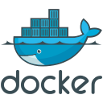
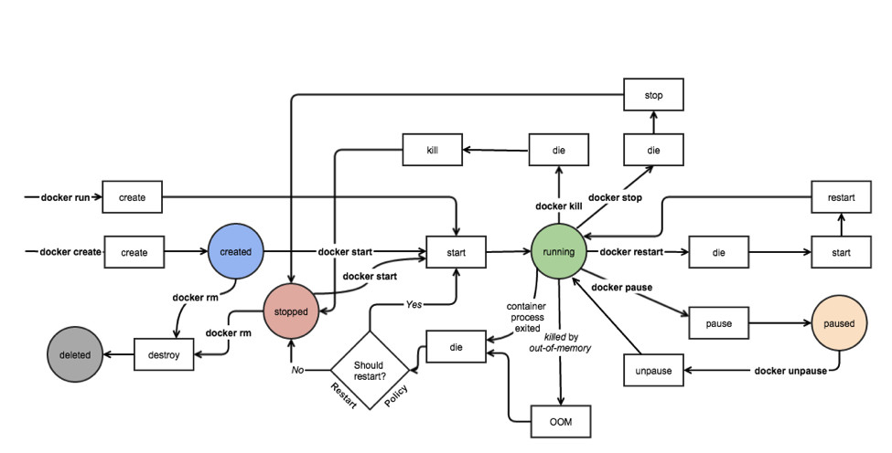

# 🐳 Docker

[](https://docs.docker.com/)

[](https://www.docker.com/)

## 主机级虚拟化

[Type1和Type2虚拟机管理程序区别](https://virtual.51cto.com/art/201904/594481.htm)

### Type1

```bash
Type1 虚拟机管理程序直接在主机的物理硬件上运行 它被称为裸机虚拟机管理程序
它不必预先加载底层操作系统 通过直接访问底层硬件而无需其他软件(例如操作系统和设备驱动程序)
```

- VMware ESXi
- Microsoft Hyper-V服务器
- 开源KVM
- ...

### Type2

```bash
Type2 虚拟机管理程序通常安装在现有操作系统之上 它称为托管虚拟机管理程序
因为它依赖于主机预先安装的操作系统来管理对CPU/内存/存储和网络资源的调用
```

- VMware Fusion
- Oracle VM VirtualBox
- 用于x86的Oracle VM Server
- Oracle Solaris Zones
- Parallels
- VMware Workstation
- ...

## 容器级虚拟化

### Namespace

[man-namespaces](https://man7.org/linux/man-pages/man7/namespaces.7.html)
[namespaces API](https://lwn.net/Articles/531381/)

```bash
clone()   # Creating a child in a new namespace

setns()   # Joining an existing namespace

unshare() # Leaving a namespace
```

Linux Namespaces
| namespace | 系统调用参数 | 隔离内容 | 内核版本 |
| -----| ---- | ---- | ---- |
| UTS | CLONE_NEWUTS | 主机名和域名 | 2.6.19 |
| IPC | CLONE_NEWIPC | 信号量/消息队列/共享内存 | 2.6.19 |
| PID | CLONE_NEWPID | 进程编号 | 2.6.24 |
| Network | CLONE_NEWNET | 网络设备/网络栈/端口等 | 2.6.29 |
| Mount | CLONE_NEWNS | 挂载点(文件系统) | 2.4.19 |
| User | CLONE_NEWUSER | 用户和用户组 | 3.8 |

### Control Groups

[man-cgroups](https://man7.org/linux/man-pages/man7/cgroups.7.html)
[linux资源管理之cgroups简介](https://tech.meituan.com/2015/03/31/cgroups.html)

```bash
cgroups是Linux内核提供的一种可以限制单个进程或者多个进程所使用资源的机制 可以对cpu/内存等资源实现精细化的控制

cgroups 的全称是control groups 
cgroups为每种可以控制的资源定义了一个子系统 典型的子系统介绍如下：
  - blkio 块设备IO
  - cpu CPU
  - cpuacct CPU资源使用报告
  - cpuset 多处理器平台上的CPU集合(按核/按比例)
  - devices 设备访问
  - freezer 挂起或恢复任务
  - memory 内存用量及报告
  - perf_event 对cgroup中的任务进行统一性能测试
  - net_cls cgroup中的任务创建的数据报文的类别标识符
```

### LXC

[whats-a-linux-container](https://www.redhat.com/zh/topics/containers/whats-a-linux-container)

- LinuX Container
  - lxc-create(创建namespace)
  - template(拉取所需发行版的仓库相关包进行安装)

### 容器编排

- machine + swarm + composer
- mesos + marathon
- kubernetes(k8s)

## Docker

```bash
# docker 容器引擎的发展
# LXC -> libcontainer -> runC
-> libcontainer(docker研发的容器引擎 替换LXC) 
-> runC(容器运行时环境标准 Docker将RunC捐赠给OCI作为OCI容器运行时标准的参考实现)
```

[docker/containerd/runC分别是什么](https://os.51cto.com/art/202110/687502.htm)

### OCI

[](https://opencontainers.org/)

Open Container Initiative

- 由Linux基金会主导于2015年6月创立
- 旨在围绕容器格式和运行时制定一个开放的工业化标准
- contains two specifications
  - the Runtime Specification (runtime-spec) 运行时标准(规范)
  - the Image Specification (image-spec) 镜像格式标准(规范)
- The Runtime Specification outlines how to run a "filesystem bundle" that is unpacked on disk
- At a high-level an OCI implementation would download an OCI Image then unpack that image into an OCI Runtime filesystem bundle

### runC

[runC](https://github.com/opencontainers/runc)

- OCF: Open Container Format
- runC: runc is a CLI tool for spawning and running containers on Linux according to the OCI specification

### docker architecture

[](https://docs.docker.com/get-started/overview/#docker-architecture)

```bash
Client -> Daemon(REST API, over UNIX sockets or a network interface)
Registry -> Host(https/http)

Registry: 仓库名(repo name) + 标签(tag) 唯一标识一个镜像
-> nginx:1.14.0
-> nginx:latest(default 最新版)

Images: An image is a read-only template with instructions for creating a Docker container
Images：静态的 不会运行
Containers：动态 有生命周期 类似命令
  /bin/ls
    - ls /etc
    - ls /var

Moby
docker-ee # 企业版
docker-ce # 社区版
```

### docker objects

[docker objects](https://docs.docker.com/get-started/overview/#docker-objects)

```bash
- images
- containers
- networks
- volumes
- plugins
- other objects
```

#### Images

- An image is a read-only template with instructions for creating a Docker container
- Often, an image is based on another image, with some additional customization
- You might create your own images or you might only use those created by others and published in a registry

#### Containers

- A container is a runnable instance of an image
- You can create/start/stop/move or delete a container using the Docker API or CLI
- You can connect a container to one or more networks, attach storage to it, or even create a new image based on its current state

### docker install

[Install Docker Engine](https://docs.docker.com/engine/install/)
[阿里云Mirrors docker-ce](https://mirrors.aliyun.com/docker-ce/)

#### docker-ce.repo

```bash
[docker-ce-stable]
name=Docker CE Stable - $basearch
baseurl=https://download.docker.com/linux/centos/$releasever/$basearch/stable
# baseurl=https://mirrors.aliyun.com/docker-ce/linux/centos/$releasever/$basearch/stable
enabled=1
gpgcheck=1
gpgkey=https://download.docker.com/linux/centos/gpg
```

#### 镜像加速

- docker cn
- [阿里云官方镜像加速](https://help.aliyun.com/document_detail/60750.html)
- 中国科技大学

```json
# 配置文件
/etc/docker/daemon.json

# 更换镜像下载仓库链接
{
    "registry-mirrors": ["系统分配前缀.mirror.aliyuncs.com "]
}
```

### docker cli

[docekr-reference](https://docs.docker.com/reference/)

```bash
docker --help

# docker event state 涉及部分常用命令
```

### docker event state

[](https://docs.docker.com/engine/reference/commandline/events/)
