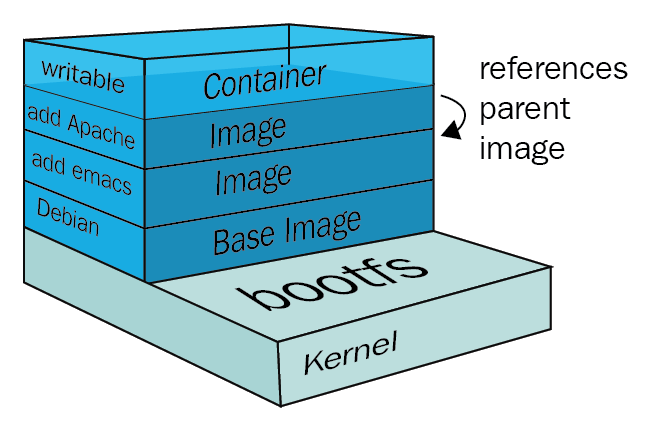
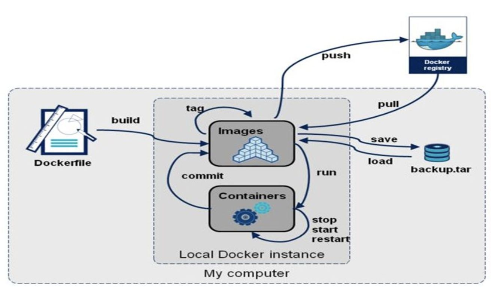
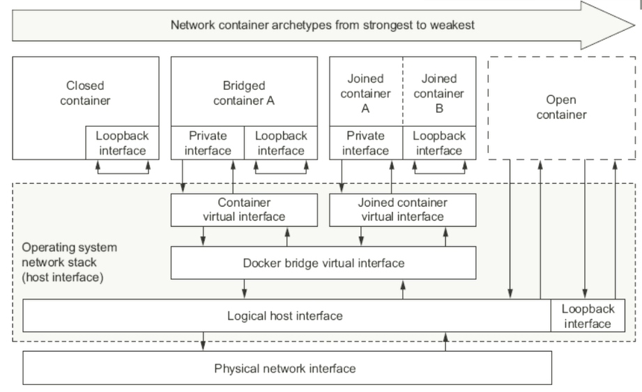

# 🐳 Docker

[](https://docs.docker.com/)

[](https://www.docker.com/)

## 主机级虚拟化

[Type1和Type2虚拟机管理程序区别](https://virtual.51cto.com/art/201904/594481.htm)

### Type1

```bash
Type1虚拟机管理程序直接在主机的物理硬件上运行 它被称为裸机虚拟机管理程序
它不必预先加载底层操作系统 通过直接访问底层硬件而无需其他软件(例如操作系统和设备驱动程序)
```

- VMware ESXi
- Microsoft Hyper-V服务器
- 开源KVM
- ...

### Type2

```bash
Type2虚拟机管理程序通常安装在现有操作系统之上 它称为托管虚拟机管理程序
因为它依赖于主机预先安装的操作系统来管理对CPU/内存/存储和网络资源的调用
```

- VMware Fusion
- Oracle VM VirtualBox
- 用于x86的Oracle VM Server
- Oracle Solaris Zones
- Parallels
- VMware Workstation
- ...

## 容器级虚拟化

### Namespace

[man-namespaces](https://man7.org/linux/man-pages/man7/namespaces.7.html)
[namespaces API](https://lwn.net/Articles/531381/)

```bash
clone()   # Creating a child in a new namespace

setns()   # Joining an existing namespace

unshare() # Leaving a namespace
```

Linux Namespaces
| namespace | 系统调用参数 | 隔离内容 | 内核版本 |
| -----| ---- | ---- | ---- |
| UTS | CLONE_NEWUTS | 主机名和域名 | 2.6.19 |
| IPC | CLONE_NEWIPC | 信号量/消息队列/共享内存 | 2.6.19 |
| PID | CLONE_NEWPID | 进程编号 | 2.6.24 |
| Network | CLONE_NEWNET | 网络设备/网络栈/端口等 | 2.6.29 |
| Mount | CLONE_NEWNS | 挂载点(文件系统) | 2.4.19 |
| User | CLONE_NEWUSER | 用户和用户组 | 3.8 |

### Control Groups

[man-cgroups](https://man7.org/linux/man-pages/man7/cgroups.7.html)
[linux资源管理之cgroups简介](https://tech.meituan.com/2015/03/31/cgroups.html)

```bash
cgroups是Linux内核提供的一种可以限制单个进程或者多个进程所使用资源的机制 可以对cpu/内存等资源实现精细化的控制

cgroups 的全称是control groups 
cgroups为每种可以控制的资源定义了一个子系统 典型的子系统介绍如下
```

- blkio 块设备IO
- cpu CPU
- cpuacct CPU资源使用报告
- cpuset 多处理器平台上的CPU集合(按核/按比例)
- devices 设备访问
- freezer 挂起或恢复任务
- memory 内存用量及报告
- perf_event 对cgroup中的任务进行统一性能测试
- net_cls cgroup中的任务创建的数据报文的类别标识符

### LXC

[whats-a-linux-container](https://www.redhat.com/zh/topics/containers/whats-a-linux-container)

- LinuX Container
  - lxc-create(创建namespace)
  - template(拉取所需发行版的仓库相关包进行安装)

### 容器编排

- machine + swarm + composer
- mesos + marathon
- kubernetes(k8s)

## Docker

```bash
# docker 容器引擎的发展
# LXC -> libcontainer -> runC
-> libcontainer(docker研发的容器引擎 替换LXC) 
-> runC(容器运行时环境标准 Docker将RunC捐赠给OCI作为OCI容器运行时标准的参考实现)
```

[docker/containerd/runC分别是什么](https://os.51cto.com/art/202110/687502.htm)

### OCI

[](https://opencontainers.org/)

Open Container Initiative

- 由Linux基金会主导于2015年6月创立
- 旨在围绕容器格式和运行时制定一个开放的工业化标准
- contains two specifications
  - the Runtime Specification (runtime-spec) 运行时标准(规范)
  - the Image Specification (image-spec) 镜像格式标准(规范)
- The Runtime Specification outlines how to run a "filesystem bundle" that is unpacked on disk
- At a high-level an OCI implementation would download an OCI Image then unpack that image into an OCI Runtime filesystem bundle

### runC

[runC](https://github.com/opencontainers/runc)

- OCF: Open Container Format
- runC: runc is a CLI tool for spawning and running containers on Linux according to the OCI specification

### docker architecture

[](https://docs.docker.com/get-started/overview/#docker-architecture)

```bash
Client -> Daemon(REST API, over UNIX sockets or a network interface)
Registry -> Host(https/http)

Registry: 仓库名(repo name) + 标签(tag) 唯一标识一个镜像
-> nginx:1.14.0
-> nginx:latest(default 最新版)

Images: An image is a read-only template with instructions for creating a Docker container
Images：静态的 不会运行
Containers：动态 有生命周期 类似命令
  /bin/ls
    - ls /etc
    - ls /var

Moby
docker-ee # 企业版
docker-ce # 社区版
```

### docker objects

[docker objects](https://docs.docker.com/get-started/overview/#docker-objects)

- images
- containers
- networks
- volumes
- plugins
- other objects

#### Images

- An image is a read-only template with instructions for creating a Docker container
- Often, an image is based on another image, with some additional customization
- You might create your own images or you might only use those created by others and published in a registry

#### Containers

- A container is a runnable instance of an image
- You can create/start/stop/move or delete a container using the Docker API or CLI
- You can connect a container to one or more networks, attach storage to it, or even create a new image based on its current state

### docker install

[Install Docker Engine](https://docs.docker.com/engine/install/)
[阿里云Mirrors docker-ce](https://mirrors.aliyun.com/docker-ce/)

#### docker-ce.repo

```bash
[docker-ce-stable]
name=Docker CE Stable - $basearch
baseurl=https://download.docker.com/linux/centos/$releasever/$basearch/stable
# baseurl=https://mirrors.aliyun.com/docker-ce/linux/centos/$releasever/$basearch/stable
enabled=1
gpgcheck=1
gpgkey=https://download.docker.com/linux/centos/gpg
```

#### 镜像加速

- docker cn
- [阿里云官方镜像加速](https://help.aliyun.com/document_detail/60750.html)
- 中国科技大学

```json
# 配置文件
/etc/docker/daemon.json

# 更换镜像下载仓库链接
{
    "registry-mirrors": ["系统分配前缀.mirror.aliyuncs.com "]
}
```

### docker cli

[docekr-reference](https://docs.docker.com/reference/)

```bash
docker --help

# docker event state 涉及部分常用命令
```

### docker event state

[](https://docs.docker.com/engine/reference/commandline/events/)

### docker image

```bash
Docker镜像含有启动容器所需的文件系统及其内容 因此 其用于创建并启动docker容器
```

#### docker image layer


- 采用分层构建机制 最底层为bootfs 其它为rootfs
  - bootfs: 用于`系统引导`的文件系统 包括`bootloader`和`kernel` 容器启动完成后会被卸载以节约内存资源
  - rootfs: 位于bootfs之上 表现为docker容器的根文件系统
    - 传统模式中 系统启动时 内核挂载rootfs时会首先将其挂载为`只读`模式(自检) 完整性自检完成后将其重新挂载为读写模式
    - docker中 rootfs由内核挂载为`只读`模式 而后通过`联合挂载`技术额外挂载一个`可写`层
- docker image layer
  - 位与下层的镜像成为父镜像(parent image) 最底层的称为基础镜像(base image)
  - 最上层的为`可读写`层 其下的均为`只读`层



#### aufs

- Advanced Mult-Layered Unification Filesystem 高级多层统一文件系统
- 用于为Linux文件系统实现`联合挂载`
- aufs是之前UnionFS的重新实现 2006年由Junjiro Okajima开发
- Docekr最初使用aufs作为容器文件系统层 它目前仍作为存储后端之一来支持
- aufs的竞争产品是overlayfs 后者自从3.18版本开始被合并到Linux内核
- docker的分层镜像 除aufs之外 docker还支持btrfs/devicemapper/vfs等
  - Ubuntu系统下 docekr默认Ubuntu的aufs 而在CentOS7上 用的是devicemapper(新版默认使用overlay2)

#### docekr registry

```bash
启动容器时 docker daemon 会试图从本地获取相关的镜像 本地镜像不存在时 其将从Registry中下载该镜像并保存到本地
```

- Registry用于保存docker镜像 包括镜像的层次结构和元数据
- 用户可以自建Registry 也可以使用官方的Docker Hub
- 分类
  - Sponsor Registry: 第三方的registry 供客户和Docker社区使用(捐赠者)
  - Mirror Registry: 第三方的registry 只让客户使用(云)
  - Vendor Registry: 由发布Docker镜像的供应商提供的registry(redhat)
  - Private Registry: 通过设有防火墙和额外安全层的私有实体提供的registry(自建)


#### registry(repository and index)

- Repository
  - 由某特定的docker镜像的`所有迭代版本`组成的镜像仓库
  - 一个Registry中可以存在多个Repository
    - Repository可分为`顶层仓库`和`用户仓库`
    - 用户仓库名称格式为`用户名/仓库名` => `ilolicon/nginx`
  - 每个仓库可以包含多个Tag(标签) 每个标签对应一个镜像
- Index
  - 维护用户账户/镜像的校验以及公共命名空间的信息
  - 相当于为Registry提供一个完成用户认证等功能的检索接口
  
#### docker hub

[docker-hub](https://docs.docker.com/docker-hub/)

Docker Hub provides the following major features:

- [Repositories](https://docs.docker.com/docker-hub/repos/): Push and pull container images
- [Teams & Organizations](https://docs.docker.com/docker-hub/orgs/): Manage access to private repositories of container images
- [Docker Official Images](https://docs.docker.com/docker-hub/official_images/): Pull and use high-quality container images provided by Docker
- [Docker Verified Publisher Images](https://docs.docker.com/docker-hub/publish/): Pull and use high- quality container images provided by external vendors
- [Builds](https://docs.docker.com/docker-hub/builds/): Automatically build container images from GitHub and Bitbucket and push them to Docker Hub
- [Webhooks](https://docs.docker.com/docker-hub/webhooks/): Trigger actions after a successful push to a repository to integrate Docker Hub with other services

#### docker pull

[pull-commandline](https://docs.docker.com/engine/reference/commandline/pull/)
[quay.io](https://quay.io/)

```bash
docker pull <registry>[:port]/[<namespace>/]<name>:<tag>

# e.g:
# registry: quay.io
# port: 443(没指定 默认)
# namespace: coreos
# name: flannel(repostory名称)
# tag: v0.15.1-arm64 指定版本
docker pull quay.io/coreos/flannel:v0.15.1-arm64
```

| Namespace | Examples(<namespace/name>) |
|-----|-----|
| organization | redhat/kubernetes google/kubernetes |
| login(user name) | alice/application ilolicon/application |
| role | devel/database test/database prod/database |

#### 镜像的相关操作



- 镜像的生成途径
  - [Dockerfile](https://docs.docker.com/engine/reference/builder/)
  - [基于容器制作](https://docs.docker.com/engine/reference/commandline/commit/)
  - Docekr Hub automated builds(仍是基于Dockerfile)

- 另一种镜像分发方式
  - [docker-save](https://docs.docker.com/engine/reference/commandline/save/)
  - [docker-load](https://docs.docker.com/engine/reference/commandline/load/)

### 容器虚拟化网络

#### 容器虚拟化网络概述

[容器虚拟化网络](https://www.cnblogs.com/hukey/p/14062579.html)

```bash
OVS: Open VSwitch
SDN
Overlay Network(叠加网络)

# docker默认的三种网络
[root@master ~]# docker network ls
NETWORK ID     NAME      DRIVER    SCOPE
78fa953ed316   bridge    bridge    local # 桥接 默认NAT桥
8ec55273feb2   host      host      local # 让容器直接使用宿主机的网络名称空间
9081fe29a218   none      null      local # 只有lo接口 没有其他网卡

[root@master ~]# yum -y install bridge-utils
[root@master ~]# brctl show
```



- Closed Container
- Bridged Container(NAT桥接网络 默认)
- Joined Container(联盟式容器网络 相对隔离 只是共享同一个网络名称空间)
- Open Container(开放式容器网络 共享宿主机网络名称空间)
