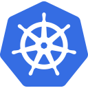
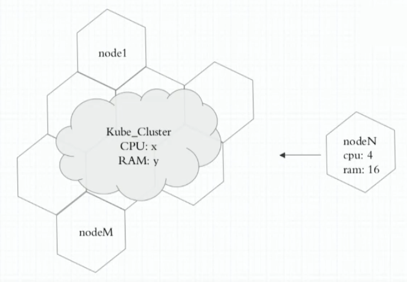
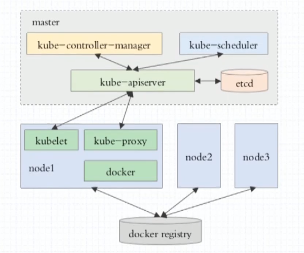

# ⭐ Kubernetes

`container evolution`

## 容器编排

- Ansible/Saltstack **传统应用**编排工具
- Docker
  - docker compose(docker单机编排)
  - docker swarm(docker主机加入docker swarm资源池)
  - docker machine(完成docker主机加入docker swarm资源池的先决条件/预处理工具)
- Mesos(IDC OS) + marathon(面向容器编排的框架)
- kubernetes(Borg)
  - 自动装箱(基于依赖 自动完成容器部署 不影响其可用性)
  - 自我修复
  - 水平扩展
  - 服务发现和负载均衡
  - 自动发布和回滚
  - 密钥和配置管理
  - 存储编排
  - 任务批量处理运行

概念: `DevOps` `MicroServices` `Blockchain`

- CI: 持续集成
- CD: 持续交互 Delivery
- CD: 持续部署 Deployment

## Kubernewtes架构概述

- 有中心节点的集群架构系统(抽象各主机资源 统一对外提供计算)
- Master/Node(Worker)
  - Master
    - etcd: 兼具一致性和高可用性的键值数据库 可以作为保存Kubernetes所有集群数据的后台数据库
    - API Server(公开kubernetes API)
    - Scheduler(调度器)
    - Controller-Manager(控制器)
      - 节点控制器(Node Controller): 负责在节点出现故障时进行通知和响应
      - 任务控制器(Job controller): 监测代表一次性任务的Job对象 然后创建Pods来运行这些任务直至完成
      - 端点控制器(Endpoints Controller): 填充端点(Endpoints)对象(即加入Service与Pod)
      - 服务帐户和令牌控制器(Service Account & Token Controllers): 为新的命名空间创建默认帐户和API访问令牌
  - Node
    - kubelet: 集群代理 并不运行容器
    - kube-proxy: 网络代理 管理Service的创建 更新(iptables/ipvs)
    - 容器运行时(容器引擎): 运行容器 支持[Docker](https://kubernetes.io/zh/docs/reference/kubectl/docker-cli-to-kubectl/)/[containerd](https://containerd.io/docs/)/[CRI-O](https://cri-o.io/#what-is-cri-o)以及任何实现 [Kubernetes CRI (容器运行环境接口)](https://github.com/kubernetes/community/blob/master/contributors/devel/sig-node/container-runtime-interface.md)

[kubernetes组件](https://kubernetes.io/zh/docs/concepts/overview/components/)

## Pod

- Pod
  - 自主式Pod
  - 控制器管理的Pod(建议使用)
    - ReplicationController(副本控制器)
    - ReplicaSet(副本集控制器 不直接使用 有一个声明式更新的控制器Deployment)
    - Deployment(管理无状态应用)
      - HPA(HorizontalPodAutoscaler) 水平Pod自动伸缩控制器
    - StatefulSet(有状态副本集)
    - DaemonSet
    - Job/CronJob
  - Label
    - Label Selector
    - Label: key=value

## Service

- iptables的DNAT规则(调度多个service后端 ipvs规则)
- 靠标签选择器 关联Pod对象
- service 名称 可以被解析(DNS Pod实现解析 - 基础架构级的Pod)
  - 基础机构级Pod `AddOns`集群附加组件 支撑其他服务需要使用到的服务
  - 动态更新DNS解析

## 网络通信

- 同一个Pod内的多个容器间: lo
- 各Pod之间的通信(不直接通信 通过Service通信)
  - 二层广播 -> 广播风暴
  - Overlay Network 叠加网络
  - 需要确保每一个Pod网络地址不会冲突
- Pod和Service之间的通信

依赖第三方插件(附件) 通过CNI(容器网络接口)接入

- flannel: 网络配置 Pod网络-10.244.0.0/16
- calico: 网络配置 网络策略
- canel: 上面两种搭配使用
- ...

## Namespace

- 管理的边界
- 隔离不同名称空间的网络

## 初始化Kubernetes集群

- [kubeadm](https://github.com/kubernetes/kubeadm)
  - master/nodes: 安装`kubetlet` `kubeadm` `docker`
  - master: `kubeadm init`
  - nodes: `kubeadm join`
